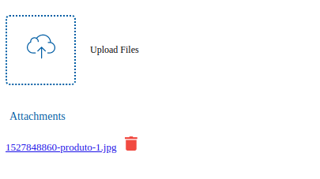

# vue-attachment

> An Attachement component for Vue.js

<center>
    <p>
        
    </p>
</center>

[![Latest Version on NPM][ico-version]][link-npm]
[![Software License][ico-license]](LICENSE.md)
[![Total Downloads][ico-downloads]][link-downloads]

This component provides an simple and out-of-box experience for file attachments.

## Installation

```
yarn add vue-attachment
```
or

```
npm i vue-attachment --save
```

## Demo

> There is an simple example on the **/demo** folder. 
[HERE](https://github.com/namadnuno/vue-attachment/tree/master/demo)

## Usage

Import Globally:
```
import Vue from 'vue'

import VueAttachment from 'vue-attachment'

Vue.use(VueAttachment)
```

Import as a Component:
import VueAttachment from 'vue-attachment'


...
{ 
    components: { VueAttachment }
}
...

### Example
```
<template>
    <form @submit.prevent="submit">
        <v-attachment v-model="attachments" endpoint="/upload.php" />
    </form>
</template>
<script>
    export default {
        data() {
            return {
                attachments: [
                    'file.pdf',
                    'image.jpg'
                ]
            }
        }
    },
    methods: {
        submit() {
            ....
        }
    }
</script>
```

### Properties

| Name                    | Type     | Required | Default         | Info                                                                        |
| ----------------------- | -------- | -------- | --------------- | --------------------------------------------------------------------------- |
| **value**               | Array    | False    | []              | List of files imported (v-model when binding is important)                  |
| **endpoint**            | String   | False    | upload.php      | Method that should returns the thumb url for the uploaded file              |

### Events

| Name         | Params                           | Info                                                                       |
| ------------ | -------------------------------- | -------------------------------------------------------------------------- |
| **success**  | server message                   | Triggered after sending file with success                                  |
| **error**    | server message                   | Triggered after sending file without success                               |
| **removed**  | filename                         | Triggered remove a file                                                    |
| **input**    | attachments                      | Triggered after an change on attachments file                              |

## License

This project is licensed under
[MIT License](http://en.wikipedia.org/wiki/MIT_License)
